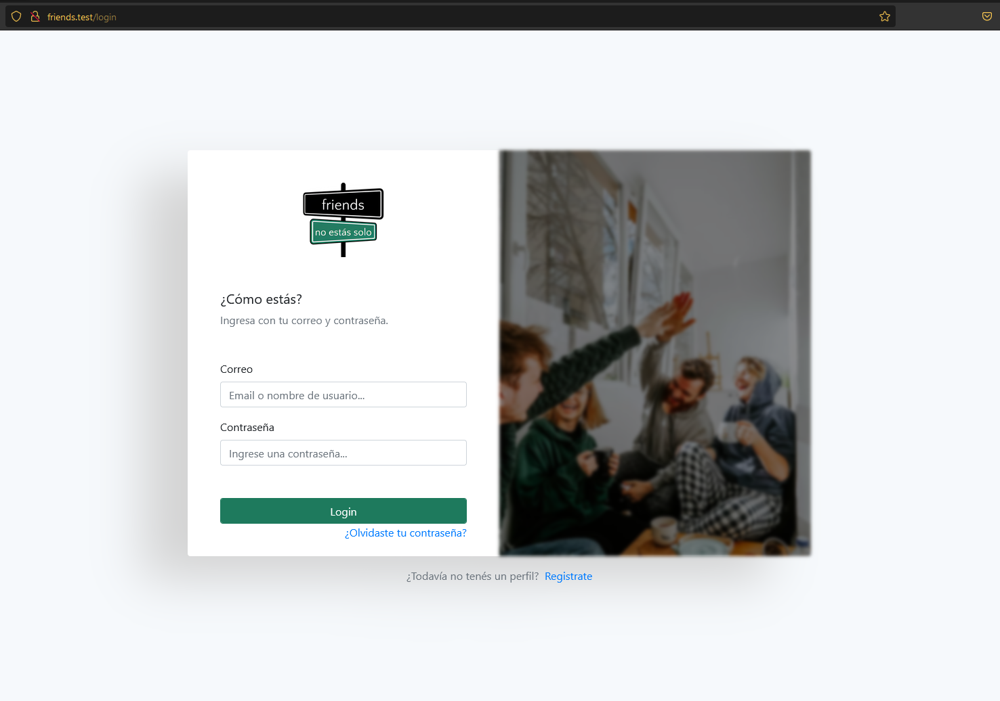
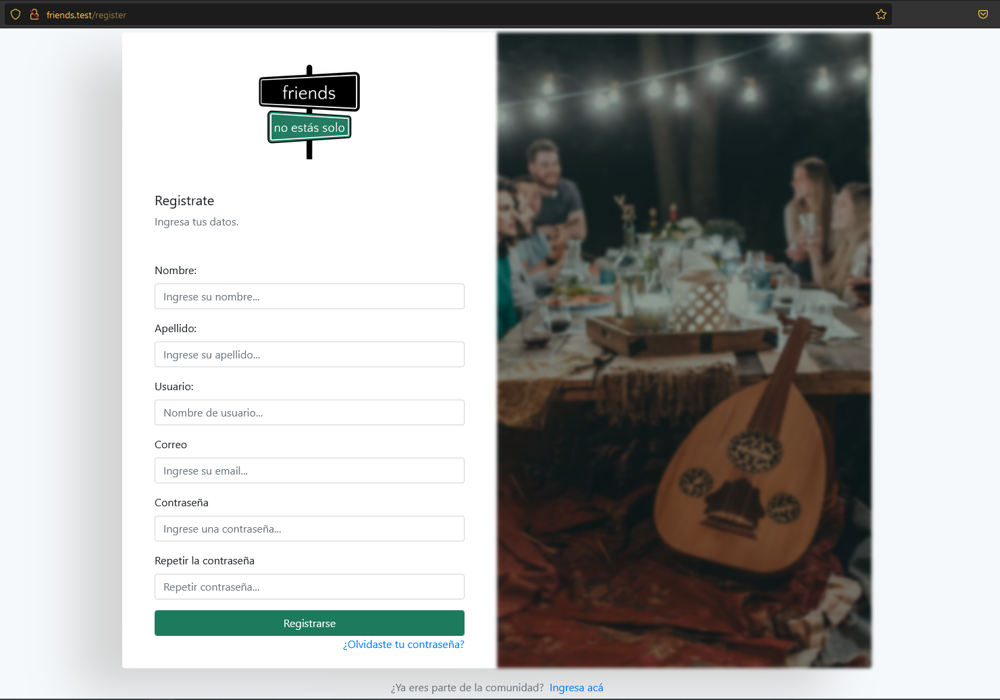

# FRIENDS - Blog (Proyecto para Práctica Profesionalizante III) 

## Instalación de las dependencias :cd:
> composer install

## Crear base de datos :floppy_disk:
```SQL
    CREATE DATABASE friends;
```
## Correr las migraciones :computer:
```
    php artisan migrate
```

## Logo

___
## Login

___
## Registro

___

Desarrollado por: [Juan González](mailto:juanchismo10@gmail.com)

[Juan Gonzalez(GitHub)](https://github.com/JotAlGe)
## License :copyright:

The Laravel framework is open-sourced software licensed under the [MIT license](https://opensource.org/licenses/MIT).
